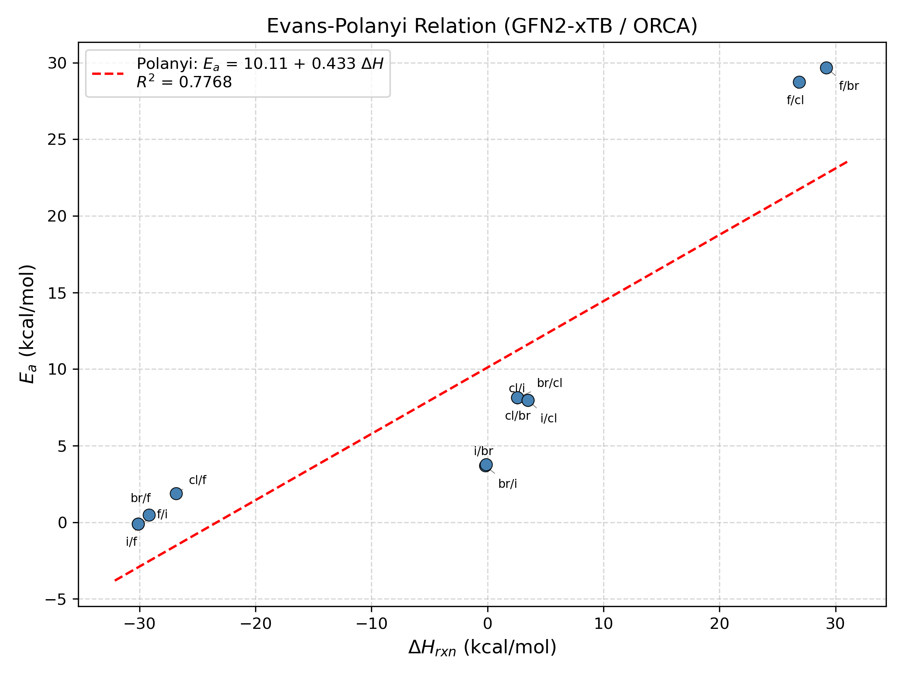
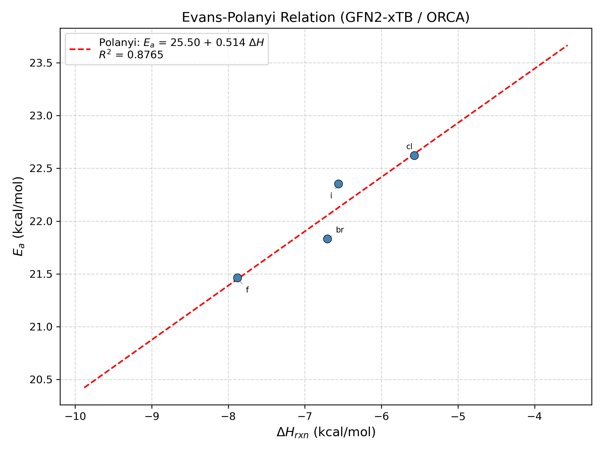

# ORCA TS Search / IRC Workflow

Transition state search and intrinsic reaction coordinate (IRC) calculation pipeline, designed for the UChicago RCC cluster using ORCA with GFN2-xTB.

## Environment Setup

```bash
module load orca
pip install pandas matplotlib numpy
```

## Input Preparation

Place an initial TS guess structure in the `TS_guess_xyz/` folder as `<system>_input.xyz`.

If you don't have a guess structure, generate one first:

```bash
# SN2 systems
python 0_prep_initial_TS_structure.py --nuc <nucleophile> --lg <leaving_group>

# Diels-Alder systems
python 0_prep_initial_TS_structure.py --family da
```

This creates the xyz file automatically for SN2 or Diels-Alder systems.

## Running the Workflow

### Option A: All-in-one (recommended)

Runs all systems through the full pipeline automatically:

```bash
# SN2 systems (12 halide-exchange reactions)
bash run_all_sn2_pipeline.sh

# Diels-Alder systems (butadiene + CH2=CHX, X = F, Cl, Br, I)
bash run_all_da_pipeline.sh
```

Each script handles: TS optimization → IRC → reactant/product geometry opt → ΔH → Polanyi analysis.

---

### Option B: Step-by-step (single system)

Use this for more control or when working on one system at a time. Replace `[system]` with the system name (e.g. `sn2_cl_br`).

```bash
# 1. Prepare TS search input
python 1_prep_TS_search.py [system] --charge <charge> --mult <multiplicity>

# 2. Run TS optimization + frequency calculation
bash 2_submit_TS_search.sh [system]

# 3. Analyze frequencies (checks for imaginary mode)
python 3_frequency_analysis.py [system]

# 4. Prepare IRC input from TS result
python 4_prep_IRC.py [system]

# 5. Run IRC
bash 5_submit_IRC.sh [system]

# 6. Plot IRC energy profile
python 6_plot_irc_energy_profile.py [system]

# 7. Prepare reactant/product geometry optimization inputs
python 7_prep_geo_opt_reactant_product.py [system]

# 8. Run reactant/product opt + frequency
bash 8_submit_geo_opt_reactant_product.sh [system]

# 9. Compute reaction enthalpy (ΔH)
python 9_compute_deltaH.py [system]

# 10. Polanyi analysis (run after multiple systems are complete)
python 10_polanyi_analysis.py
```

Outputs (plots, reports) are written to `output/`.

## Evans-Polanyi Results

The Polanyi analysis fits Ea vs ΔH separately for each reaction family, since Evans-Polanyi applies within analogous reactions:

- **SN2**: `output/sn2_polanyi_plot.png` — 12 halide-exchange reactions (R² = 0.78)
- **Diels-Alder**: `output/da_polanyi_plot.png` — 4 dienophile substituents F, Cl, Br, I (R² = 0.88)




---

## Notes

- **`[system]`** is optional for steps 1, 3, 4, and 6 if `TS_guess_xyz/` contains exactly one `*_input.xyz` file.
- **Charge and multiplicity** must be set correctly:
  - **SN2**: e.g., F⁻ + CH₃Cl → CH₃F + Cl⁻: charge = `-1`, multiplicity = `1`.
  - **Diels-Alder**: e.g., butadiene + CH₂=CHI: charge = `0`, multiplicity = `1`.
- **Step 3** confirms the TS has exactly one imaginary frequency — if not, the TS guess or optimization needs to be revisited before proceeding.
